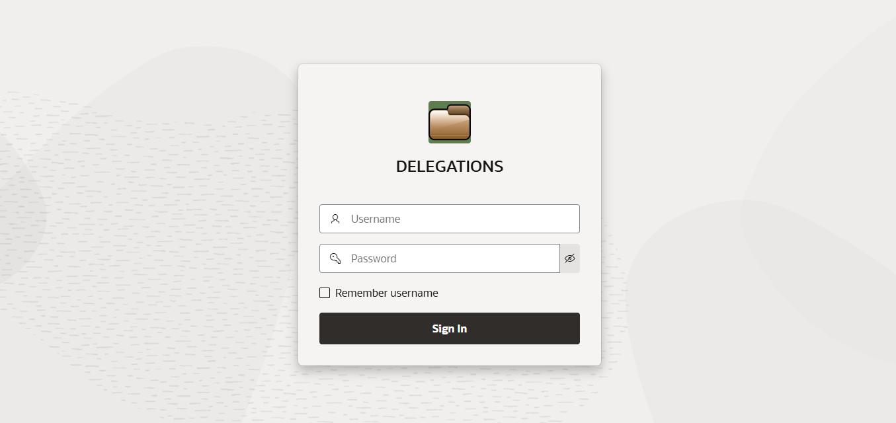
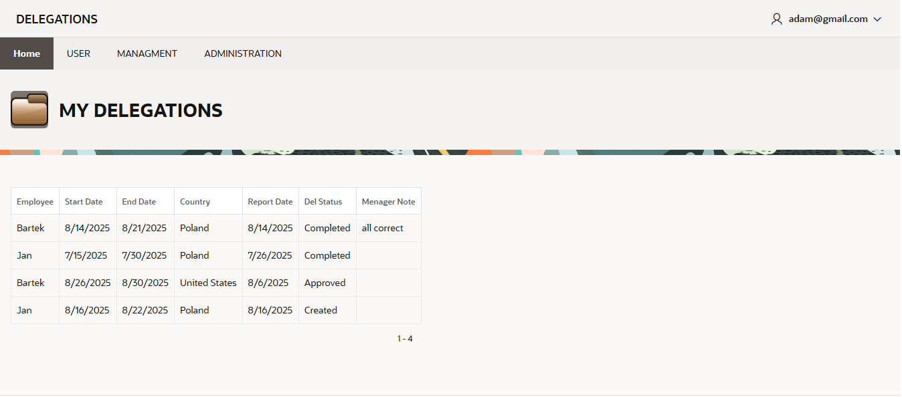
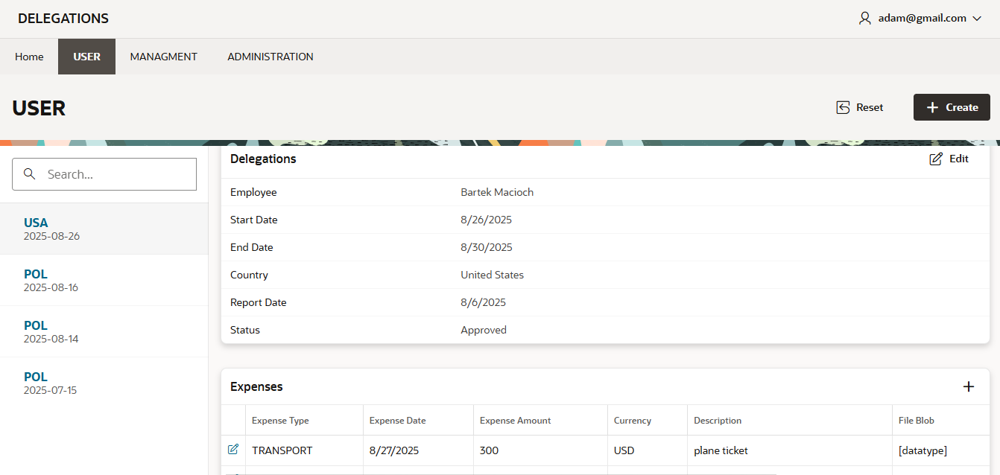
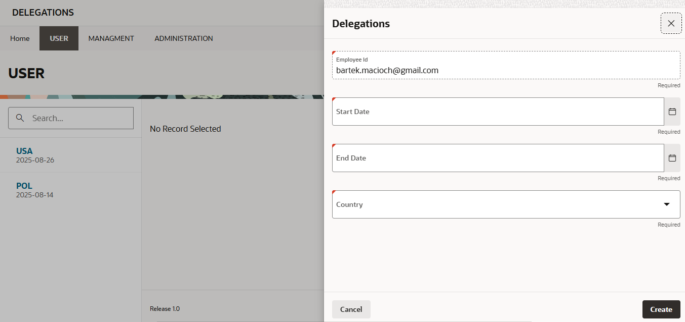
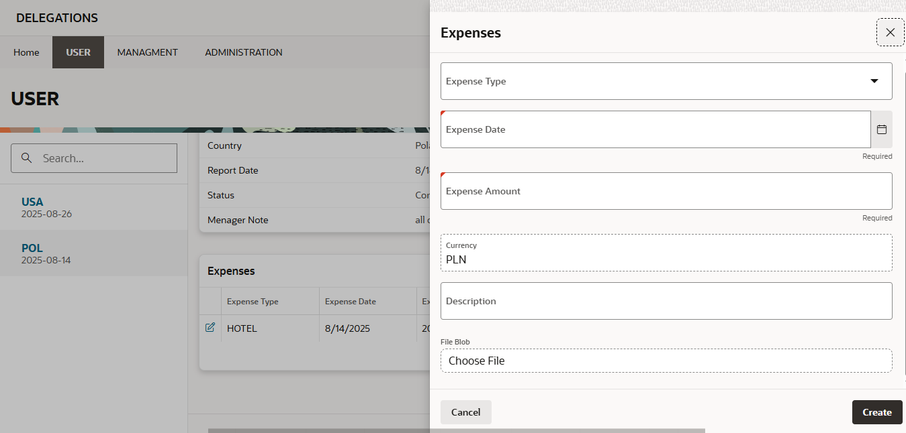
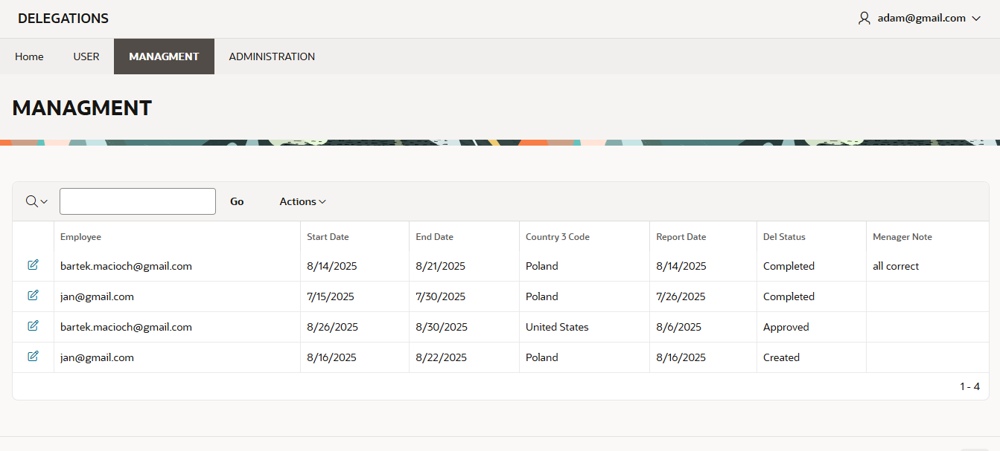
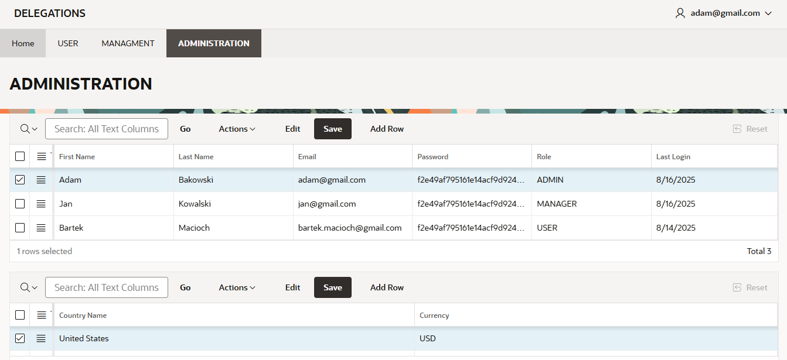
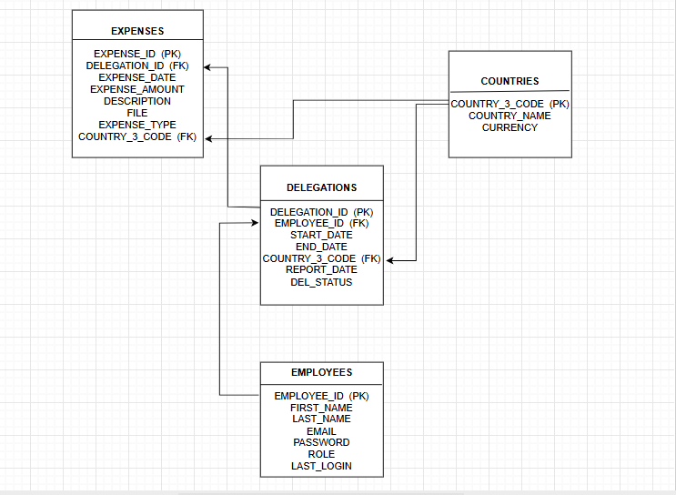

# delegations-apex

Oracle APEX 24.2 application for managing business delegations and expenses.  
The system supports multiple roles: **USER, MANAGER, ADMIN**.  
It includes authentication, expense tracking with file uploads, and approval workflow.

---

## Features
- 🔑 User authentication with hashed passwords
- 👨‍💼 Role-based access (USER, MANAGER, ADMIN)
- 🌍 Delegation management (country, dates, notes)
- 💰 Expense tracking (amounts, types, attachments)
- ✅ Manager approval for delegations and expenses
- 👥 Admin panel for employee and role management

---

## Installation
1. Run `DELEGATIONS_DDL.sql` to create the database schema.  
2. Import `f13700.sql` into Oracle APEX (Application Builder → Import).  
3. Create users in the **Employees** table (roles: USER, MANAGER, ADMIN).  
4. Log in with your credentials.

---

## Technologies
- Oracle APEX 24.2
- Oracle Database (PL/SQL, SQL)
- Triggers & Functions for authentication and password hashing

---

## Screenshots

### Login Page
Login screen with password hashing mechanism.  

### Dashboard
Main dashboard with quick access to core functions.  

### User Panel
User panel – view and manage your own delegations and expenses.  

### Delegation Form
Form for creating a business delegation (country, start and end dates, notes).  

### Expenses Form
Form for recording expenses (amount, type, description, attachments).  

### Manager Panel
Manager panel – approve delegations and expenses submitted by employees.  

### Admin Panel
Admin panel – manage employees, roles, and permissions.  

### Database ERD
Entity-relationship diagram of the database schema.  

---

## Author
👤 Bartłomiej Macioch
