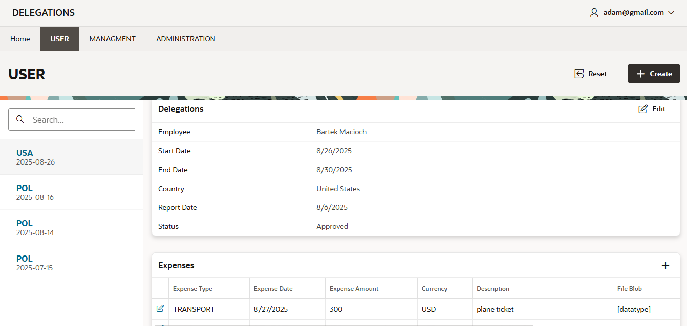
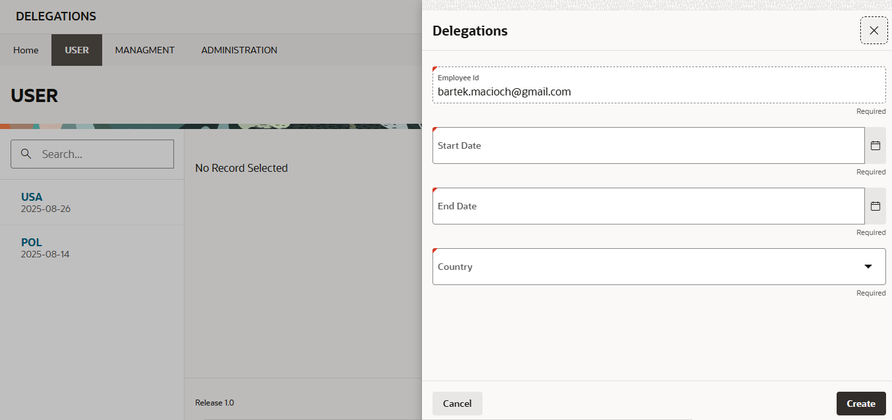
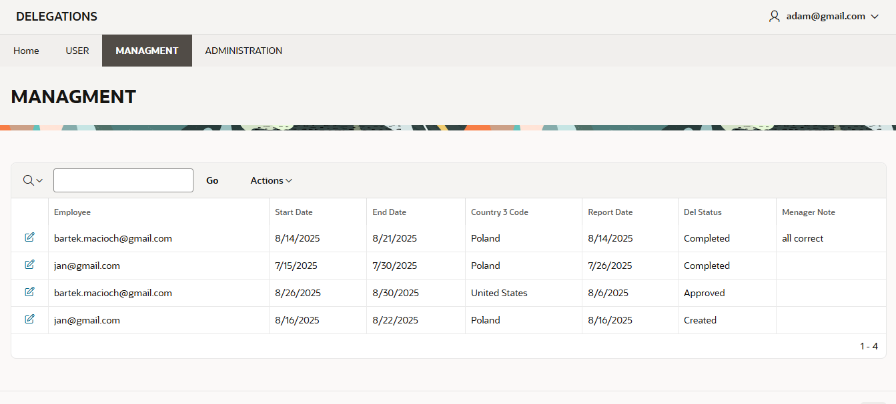

# delegations-apex

Oracle APEX 24.2 を使用した出張・経費管理アプリケーション。  
ユーザー権限は **USER / MANAGER / ADMIN** に分かれています。  
認証機能、経費登録、ファイルアップロード、承認ワークフローを含みます。

---

## 主な機能
- 🔑 パスワードハッシュによるユーザー認証
- 👨‍💼 権限別アクセス制御 (USER, MANAGER, ADMIN)
- 🌍 出張の登録・管理 (国・日付・備考)
- 💰 経費管理 (金額・種類・添付ファイル)
- ✅ マネージャーによる承認フロー
- 👥 管理者パネルで従業員・権限の管理

---

## 画面イメージ

### ログイン画面

### ダッシュボード

### ユーザーパネル

### 出張登録フォーム

### 経費登録フォーム

### マネージャーパネル

### 管理者パネル

### データベース ERD

---

## 作者
👤 Bartłomiej Macioch
